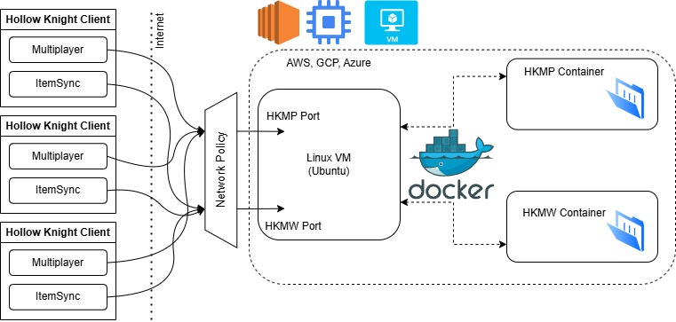

# Hollow Knight Cloud Servers

 

Taking Hollow Knight to cloud compute.

> [!CAUTION]
> Cloud compute costs real world money. The tutorials here try to use free tiers that can essentially be ran 24/7 at no cost.
> However, sloppy administration of compute resources can and will lead to real world charges. Thar be dragons.

## Supported CSPs

- [Google Cloud Platform](gcp)
- [Amazon Web Services](aws)
- [Microsoft Azure](azure)

> [!TIP]
> If you do not want to use the CSPs listed or want to host these servers on your own stack, check out the server containers below!

> [!TIP]
> At time of writting, GCP seems to be the best offer since they provide a free service with no limit at the moment although AWS has slightly easier steps.

## Supported Servers

- [Hollow Knight Multiplayer](docker/hkmp)
- [Hollow Knight Multiworld / ItemSync](docker/hkmw)

## Get Started

1. Pick a CSP you wish to use, follow the instructions in the documentation to allocate infrastructure.

2. Launch the server containers you wish to host by following the instructions in the respective server folder.

3. Play the game.

## Motivation

I wanted to learn about different CSPs.
But some advantages that could be of interest include:

- Host a server anywhere around the globe
- Keep server traffic off your personal machine
- Do not need to give other's access to your personal network / IP
- Do not need to mess with your router for port forwarding
- No need for third party programs to create some LAN network
- Server host is now cloud platform, which is secure and reliable
- Play with as many people as you want
- Hosting a HK server in the cloud for a weekend will at most cost few dollars. No extended subscription model, use it when you need it

## Support

For issues / bugs, I probably won't fix them but feel free to open an issue.
I also won't bother the modding discord, this is pretty fringe HK modding.